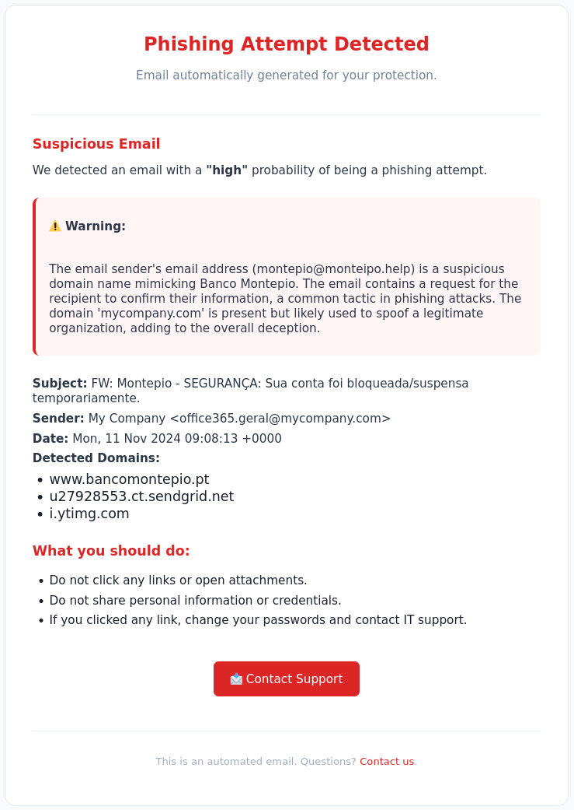

<div align="center">
  
</div>
<div align="center">


[](https://www.python.org/)
[](https://ollama.ai/)

</div>

# INBOX LLM Agent

**INBOX LLM Agent** is an open-source experimental project that reimagines email management through the power of local Large Language Models (LLMs). Designed as a privacy-first Proof of Concept, it processes emails entirely offline, combining AI automation with full user control.


## 🌟 Why?

In an era where email overload is a daily struggle and privacy concerns are paramount.

- **Complete Privacy**: Your emails never leave your device - no cloud APIs, no data sharing
- **AI-Powered Intelligence**: Leverages cutting-edge local LLMs for smart email processing
- **Efficiency First**: Automated summarization, intelligent drafting, and streamlined workflows
- **Fully Customizable**: Modular architecture designed for experimentation and extension

## ✨ Features

| Feature | Description | Status |
|---------|-------------|--------|
| 📥 **Email Reading** | Reads and extracts `.eml` files from the inbox | ✅ |
| 💾 **Email Storage** | Stores received `.eml` files locally | ✅ |
| 🔐 **DKIM Analysis** | Verifies DKIM authentication to validate the sender | ✅ |
| 🌐 **Google Safe Browsing** | Checks URLs using the Google Safe Browsing API | ✅ |
| 🧠 **LLM Analysis** | Uses a local language model to analyze email content | ✅ |
| 🗃️ **Database Storage** | Saves analysis results to a local database | ✅ |
| 📬 **Real-Time Alerting** | Sends notifications via email on phishing detection | ✅ |
| 🖥️ **Dashboard Analytics** | Visualization and insights based on the SQLite database | ❌ |
| 🕵️ **Security Scanning** | Attachment scanning via ClamAV integration | ❌ |
| 🔍 **Authentication Validation** | Full DKIM, DMARC, and SPF checks | ❌ |
| 🔄 **Multi-model Analysis** | Compare responses across different local LLMs | ❌ |
| 📊 **Batch Processing** | Efficient processing of large volumes of emails | ❌ |
| 🔐 **Enhanced Security** | Advanced credential and secret management | ❌ |
| 🖼️ **URL Screenshot Capture** | Captures screenshots of webpages linked in suspicious emails | ❌ |
| 🔍 **OCR on Screenshots** | Applies OCR (e.g., Tesseract) to extract visible text from captured images | ❌ |
| 🧠 **Computer Vision Analysis** | Uses models like ViT or CLIP to detect suspicious visual elements (e.g., fake logos) | ❌ |
| 🔗 **Multimodal Contextualization** | Combines text, screenshots, domains, and metadata for integrated analysis | ❌ |
| 📚 **Continual Learning** | System learns from previous analyses using supervised feedback | ❌ |
| 📡 **Threat Intelligence Integration** | Connects to AbuseIPDB, VirusTotal, OTX, etc. for IoC reputation checks | ❌ |
| ⛓️ **Chained Link Analysis** | Follows redirects and URL shorteners to find final destinations | ❌ |
| 🔐 **GPG/PGP Integration** | Detects and analyzes encrypted or signed emails | ❌ |
| 🛠️ **Model Fine-tuning** | Custom LLM training for email-specific use cases | ❌ |


## 🚀 Quick Start

### Prerequisites

Before you begin, ensure you have:

- **[Python 3.9+](https://www.python.org/downloads/)** - Programming language runtime
- **[Ollama](https://ollama.ai/)** - Local LLM inference engine
- **[Git](https://git-scm.com/downloads)** - Version control system
- **Email account** with IMAP/SMTP enabled ([Gmail](https://gmail.com), [Outlook](https://outlook.com), etc.)

### Installation

1. **Clone the repository**
   ```bash
   git clone https://github.com/h4ndsh/InBoxLLMAgent.git
   cd InBoxLLMAgent
   ```

2. **Set up Python environment**
   ```bash
   # Create virtual environment (recommended)
   python -m venv venv
   source venv/bin/activate  # On Windows: venv\Scripts\activate
   
   # Install dependencies
   pip install -r requirements.txt
   ```

3. **Configure Ollama**
   ```bash
   # Install and start Ollama
   ollama serve
   
   # Pull your preferred model (choose one)
   ollama pull gemma3:latest
   ```

4. **Configure your settings**
   ```bash
   # Copy example configuration
   cp env.json.example env.json
   ```
   
   Edit `env.json` with your credentials

5. **Launch the application**
   ```bash
   python main.py
   ```
   Verbose mode

   ```bash
   python main.py --verbose
   ```

### 🐳 **Docker**

🚧 *Not implemented*


## 📧 Example Alert Email

Below is an example of the alert email generated by the system:

<div align="center">
  
</div>

## ⚠️ Important Notes

**This is a Proof of Concept** - INBOX LLM Agent is designed for experimentation and testing. While functional, it's not recommended for production environments without thorough testing and security review.

**Privacy Commitment** - All processing happens locally. Your emails, credentials, and generated content never leave your machine.


## 📜 License

This project is licensed under the MIT License - see the [LICENSE](LICENSE) file for details.


<div align="center">

**[⭐ Star this repo](https://github.com/h4ndsh/InBoxLLMAgent)** • **[🐛 Report Bug](https://github.com/h4ndsh/InBoxLLMAgent/issues)** • **[💡 Request Feature](https://github.com/h4ndsh/InBoxLLMAgent/issues)**

*Built with ❤️*

</div>
